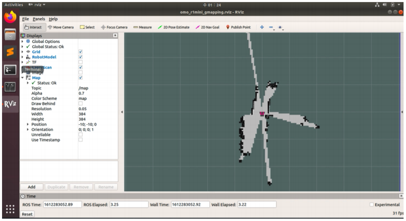
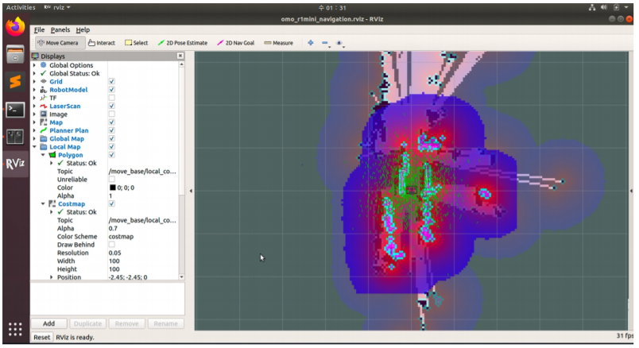

# OMOROBOT *R1mini PRO*
---
<div align="left">
  
</div>
This project is about ROS Package for OMOROBOT's R1mini mobile robot platform.  

## Overview

다음은 R1mini Pro 대표 이미지 이며 다음 [페이지](https://smartstore.naver.com/omorobot/products/5760164420)에서 구매하실 수 있습니다. 
Below image represents R1mini PRO which can be purchased from [here](https://omorobot.com/product/r1-mini/).
<div align="center">
  
</div>

한글 튜토리얼 깃북은 다음 페이지를 참조하세요.
[https://omorobot.gitbook.io/manual/product/omo-r1mini/ros](https://omorobot.gitbook.io/manual/product/omo-r1mini/ros)

For English version tutorial, please refer to below gitbook page.
[https://kairosiann.gitbook.io/r1mini/](https://kairosiann.gitbook.io/r1mini/)

## Installation

This package assumes you are running nvidia's **Jetson nano** board as **ROBOT** which comes with R1mini PRO pakcage. 
If you have installed Jetson nano yourself and setup from scratch, please download our Jetson nano image file [jetson_210720.img](https://www.dropbox.com/s/955eac4ffhbajyu/jetson_210720.img?dl=0) and flash into 32gb micro sdcard. 
You can use [etcher](https://www.balena.io/etcher/) for flashing image to sdcard.

This image comes with following setup
- Jetpack 4.4
- ROS-melodic
- Catkin workspace is located in ~/catkin_ws
- Default sudo password is "1"

Once you flash installed Jetson nano, just login with default password and try to git pull this project by
```
$ cd ~/catkin_ws/src/omo_r1mini
$ git pull
```


## Additional packages

Below pacakges are maybe required run this package and are located in ROBOT's **catkin_ws/src** folder
- https://github.com/PinkWink/ydlidar to run ydlidar
- https://github.com/PinkWink/darknet_ros for running YOLO v3 
- https://github.com/Tossy0423/yolov4-for-darknet_ros for running YOLO v4


## Dependency

In order to run all the packages included in this project, you may need to install additional ROS packages as below.

```
sudo apt-get install ros-melodic-tf ros-melodic-joy \
ros-melodic-teleop-twist-joy \
ros-melodic-teleop-twist-keyboard \
ros-melodic-laser-proc ros-melodic-rgbd-launch \
ros-melodic-depthimage-to-laserscan \
ros-melodic-rosserial-arduino ros-melodic-rosserial-python \
ros-melodic-rosserial-server ros-melodic-rosserial-client \
ros-melodic-rosserial-msgs ros-melodic-amcl \
ros-melodic-map-server ros-melodic-move-base \
ros-melodic-urdf ros-melodic-xacro ros-melodic-usb-cam \
ros-melodic-compressed-image-transport \
ros-melodic-rqt-image-view ros-melodic-gmapping \
ros-melodic-navigation ros-melodic-interactive-markers \
ros-melodic-ar-track-alvar ros-melodic-ar-track-alvar-msgs 
```

## Running the Robot

To simply run the robot to control with teleop keyboard command, enter below while roscore is running in the **HOST PC**

```
$ roslaunch omo_r1mini_bringup omo_r1mini_bringup.launch
$ roslaunch omo_r1mini_teleop omo_r1mini_teleop_key.launch
```
This allows you to move the robot simply by keyboard input as
- W: Move FWD (Increase lin_vel.x)
- A: Turn Left (Increase rot_vel.z)
- S: Stop (Reset lin_vel.x, rot_vel.z)
- D: Turn Right (Decrease rot_vel.z)
- X: Move REV (Decrease lin_vel.x)

## SLAM Mapping
<div align="center">
  
</div>
To run 2D lidar based SLAM navigation, simply launch below in ROBOT
```
$ roslaunch omo_r1mini_bringup omo_r1mini_robot.launch
$ roslaunch omo_r1mini_slam omo_r1mini_slam.launch
```
Launch below in HOST PC to open rviz environment to make map
```
$ roslaunch omo_r1mini_slam omo_r1mini_slam_rviz.launch
$ roslaunch omo_r1mini_teleop omo_r1mini_teleop_key.launch
```
Move the robot using keyboard input (W: FWD, A: Left, D: Right, X: REV) and map will be expanded as it go.
Once map is fully generated, enter below to save **map.yaml** and **map.pgm** files.
```
$ rosrun map_server map_saver -f map
```
Terminate all nodes and copy these files and place into ROBOT's *~/catkin_ws/src/omo_r1mini/omo_r1mini_navigation/maps* 

## SLAM Navigation

<div align="center">
  
</div>

To start SLAM navigation launch below in ROBOT.

```
$ roslaunch omo_r1mini_bringup omo_r1mini_robot.launch
$ roslaunch omo_r1mini_navigation omo_r1mini_navigation.launch
```
Then launch below in HOST PC to open the robot in rviz environment.
```
$ roslaunch omo_r1mini_navigation omo_r1mini_navigation_rviz.launch
```

Place the robot in the map by selecting green arrow(**2D Pose Estimate**) in the top menu and **pick**(Location) and **drag**(direction) where the robot likely to be and its direction in the map.

Now place a **goal** by selecting Pink arrow(**2D Nav Goal**) in the top menu and **pick**(Goal location) and **drag**(Goal direction) where the robot should go in the map.

Wait until the robot reaches the goal!

---

OMOROBOT INC